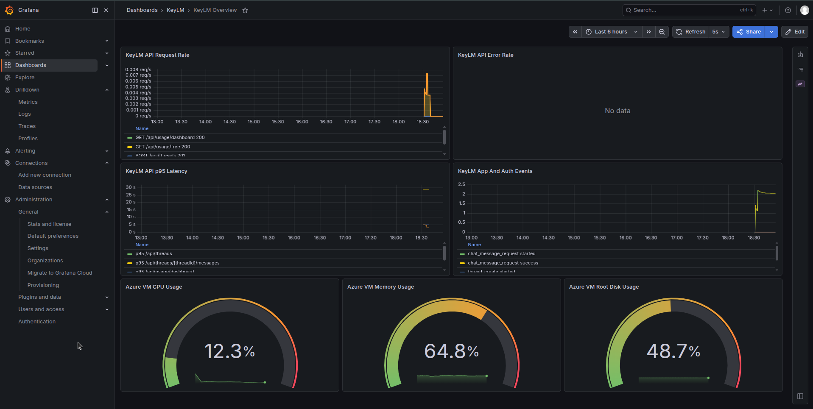
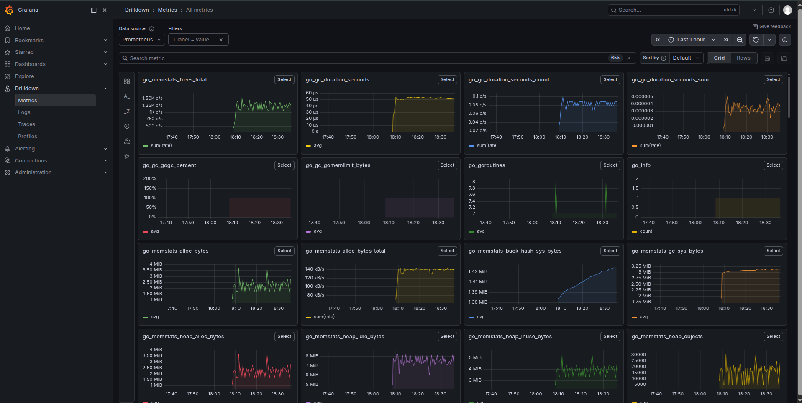
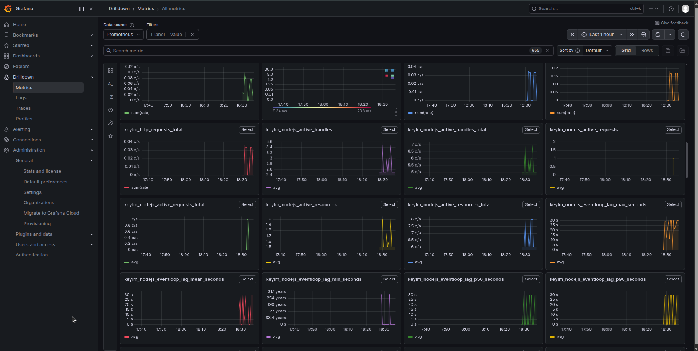
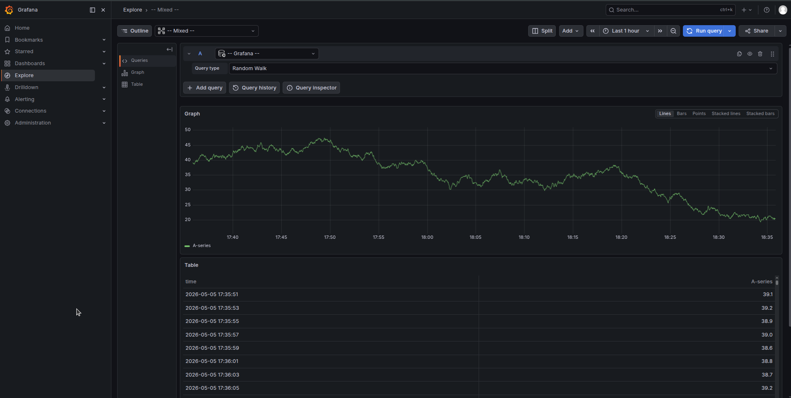
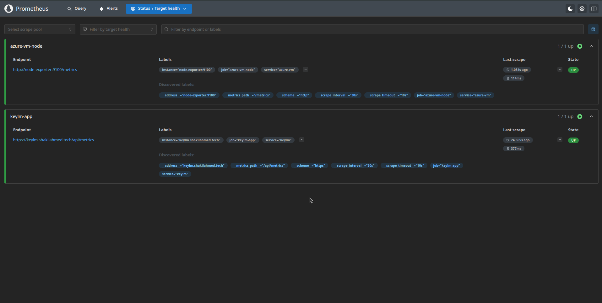

# KeyLM Infra Monitoring

This repository provides comprehensive infrastructure monitoring for the KeyLM project using Prometheus and Grafana. It allows real-time tracking of system performance, application metrics, and database queries.

## Live Site & Configuration

- **Live Website:** [https://keylm.shakilahmed.tech/](https://keylm.shakilahmed.tech/)
- **Setup Guide:** Check out the **[SETUP.md](./SETUP.md)** file for detailed instructions on configuring and running this project.

## Dashboard Overview

Explore the various monitoring visualizations available in our deployment. Click on any dashboard preview below for a closer look.

  <b>Main Setup Dashboard</b> 
  
    

  <b>Go Runtime Metrics</b> 
  
    

  <b>General System Metrics</b> 
  
    

  <b>Database Queries</b> 
  
    

  <b>Prometheus Up Status</b> 
  

