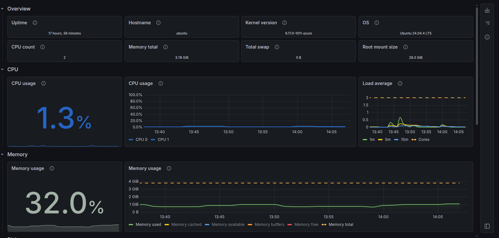
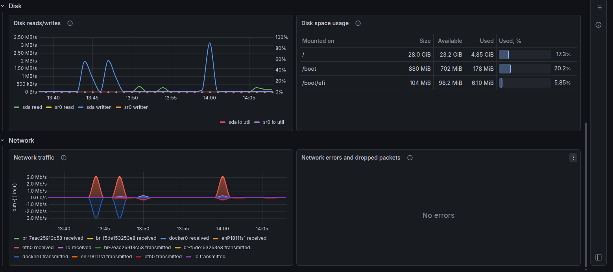

# KeyLM Infra Monitoring

This repository provides comprehensive infrastructure monitoring for the KeyLM project using Prometheus and Grafana. It allows real-time tracking of system performance, application metrics, and database queries.

## Live Site & Configuration

- **Live Website:** [https://keylm.shakilahmed.tech/](https://keylm.shakilahmed.tech/)
- **Setup Guide:** Check out the **[SETUP.md](./SETUP.md)** file for detailed instructions on configuring and running this project.

## Dashboard Overview

Explore the various monitoring visualizations available in our deployment. Click on any dashboard preview below for a closer look.

  <table>
    <tr>
      <td colspan="2" align="center">
        <b>Main Setup Dashboard</b> 
         
        <i>Overview of the KeyLM main application status and general configuration.</i>
      </td>
    </tr>
    <tr>
      <td align="center">
        <b>OS Monitor</b> 
         
        <i>Detailed operating system metrics including disk I/O and network traffic trends.</i>
      </td>
      <td align="center">
        <b>Network & Disk Monitor</b> 
         
        <i>Additional OS-level visualizations tracking process counts and system uptime elements.</i>
      </td>
    </tr>
    <tr>
      <td align="center">
        <b>Database Queries</b> 
         
        <i>Tracks database query performance, latency, and execution times on our servers.</i>
      </td>
      <td align="center">
        <b>Prometheus Up Status</b> 
         
        <i>Shows the real-time health and scrape configuration status of all metrics targets.</i>
      </td>
    </tr>
    <tr>
      <td align="center">
        <b>Go Runtime Metrics</b> 
         
        <i>Monitors Go application performance including memory usage and garbage collection.</i>
      </td>
      <td align="center">
        <b>General System Metrics</b> 
         
        <i>Displays system-level resource utilization like CPU, RAM, and container metrics.</i>
      </td>
    </tr>
  </table>

